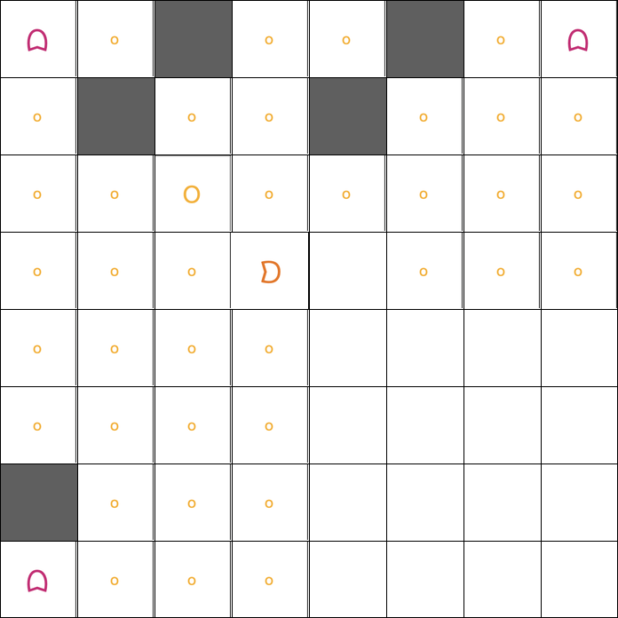

# Programming and Laboratory Project, A.Y. 2025/2026

This project involves implementing a simplified version of the classic game [Pac-Man](https://www.google.com/logos/2010/pacman10-i.html), focusing on (1) representing a single snapshot of the game as a 2D grid with quad-tree serialization, (2) implementing the movement logic for Pac-Man and the four ghosts, and (3) maintaining the *history* of the game as a singly-linked list of snapshots.

The project requires the implementation of **two** classes, `game_state` and `pacman`, as described in this document.

* A `game_state` is a *value* representing one snapshot of the game (the grid plus a few counters). Two `game_state` objects can be compared, copied, serialized to/from XML, and modified cell by cell.
* A `pacman` is the *container* that owns the whole game: an invariant game size and a singly-linked list of `game_state` snapshots representing every position the game has ever been in. The game logic (`move(...)`) and the iterators live on this class.

### Table of contents

1. [The `game_state` class](#game_state)
2. [The `pacman` class](#pacman)
3. [How to Test Your Code?](#testing)
4. [Project Submission](#submission)
5. [Project Evaluation](#evaluation)
6. [GitHub Issues](#issues)

---

## 1. The `game_state` class <a name="game_state"></a>

The `game_state` class represents one snapshot of the Pac-Man game: the grid plus the running counters of score, lives, remaining pellets, and the panic countdown.

```cpp
struct game_state {
    (...)
private:
    uint32_t    m_size;
    uint32_t    m_score;
    uint32_t    m_lives;
    uint32_t    m_pellets_left;
    uint32_t    m_panic_countdown;
    cell_type** m_grid;
};
```

A `game_state` object **does not** carry any history pointers: it is a plain value, and copies / assignments behave exactly as one expects of a value type (deep-copy the grid and the scalars). The history is the responsibility of the `pacman` class.

### Grid and Cell Types

The game world is a squared grid of size `m_size x m_size`. The size must be 0 or a power of 2 greater than or equal to 4 (i.e. one of `0, 4, 8, 16, 32, ...`). A state with `m_size == 0` is the *empty* state (no grid allocated; `m_grid == nullptr`).

Each cell in the grid is one of the values of the `cell_type` enum:

* `empty`: an empty region where a character can move.
* `wall`: an obstacle. No character can occupy this region.
* `pellet`: regular food (10 points when Pac-Man eats it).
* `power_pellet`: special food that triggers "Panic Mode" (50 points).
* `pacman`: the player character.
* `ghost1`, `ghost2`, `ghost3`, `ghost4`: the four enemy ghosts.

**Indexing convention.** A cell is identified by a pair `(i, j)`, where `i` is the **row index** (counting from 0 at the top) and `j` is the **column index** (counting from 0 at the left). The grid is stored as `m_grid[i][j]`. The top-left cell is `(0, 0)`, the bottom-right cell is `(m_size-1, m_size-1)`. The four ghost corners and Pac-Man's reset position are:
```
ghost1 (top-left)     = (0,      0     )
ghost2 (top-right)    = (0,      size-1)
ghost3 (bottom-left)  = (size-1, 0     )
ghost4 (bottom-right) = (size-1, size-1)
Pac-Man centre        = (size/2, size/2)
```

### Grid File Format

A `game_state` is serialized to / parsed from an XML format using `operator<<` and `operator>>`. The 2D grid is encoded with a [quad-tree](https://en.wikipedia.org/wiki/Quadtree) structure that recursively decomposes the grid into its four quadrants `TL`, `TR`, `BL`, `BR` (top-left, top-right, bottom-left, bottom-right, **in that order**).

The root element is `<game_state>`, with the metadata as attributes (`size`, `score`, `lives`, `pellets_left`, `panic_countdown`; the order of attributes is not significant). Its body is a sequence of `<node>` elements describing the grid:

* **Leaf node (uniform quadrant):** if a quadrant consists entirely of cells of the same `cell_type`, it is written as a *self-closing* `<node>` tag with a `type` attribute, e.g. `<node type="pellet"/>`.
* **Internal node (mixed quadrant):** otherwise, the `<node>` tag is *not* self-closing and contains exactly four child `<node>` elements describing its `TL`, `TR`, `BL`, `BR` sub-quadrants, in that order, terminated by `</node>`.

The parser must accept arbitrary whitespace (spaces, tabs, newlines) between tokens, exactly as discussed during lectures.

**Example.**

The following 8 x 8 grid (small circles are pellets, the large circle is a power pellet, gray squares are walls, the magenta characters are ghosts, the orange one is Pac-Man) is encoded as the XML below. Notice in particular that the entire bottom-right 4 x 4 quadrant is empty, so it is serialised as a single self-closing leaf `<node type="empty"/>` at level 1 of the tree:

<p align="center">
  
</p>

```xml
<game_state score="0" lives="3" size="8" pellets_left="38" panic_countdown="0">
    <node>
        <node>
            <node type="ghost1"/>
            <node type="pellet"/>
            <node type="pellet"/>
            <node type="wall"/>
        </node>
        <node>
            <node type="wall"/>
            <node type="pellet"/>
            <node type="pellet"/>
            <node type="pellet"/>
        </node>
        <node type="pellet"/>
        <node>
            <node type="power_pellet"/>
            <node type="pellet"/>
            <node type="pellet"/>
            <node type="pacman"/>
        </node>
    </node>
    <node>
        <node>
            <node type="pellet"/>
            <node type="wall"/>
            <node type="wall"/>
            <node type="pellet"/>
        </node>
        <node>
            <node type="pellet"/>
            <node type="ghost2"/>
            <node type="pellet"/>
            <node type="pellet"/>
        </node>
        <node>
            <node type="pellet"/>
            <node type="pellet"/>
            <node type="empty"/>
            <node type="pellet"/>
        </node>
        <node type="pellet"/>
    </node>
    <node>
        <node type="pellet"/>
        <node type="pellet"/>
        <node>
            <node type="wall"/>
            <node type="pellet"/>
            <node type="ghost3"/>
            <node type="pellet"/>
        </node>
        <node type="pellet"/>
    </node>
    <node type="empty"/>
</game_state>
```

A leaf at level `i` (with `i = 0` for the root) spans a `(size / 2^i) x (size / 2^i)` square. So for an 8 x 8 grid entirely empty:

```xml
<game_state score="150" lives="3" size="8" pellets_left="0" panic_countdown="0">
    <node type="empty"/>
</game_state>
```

For an 8 x 8 grid whose top-left and bottom-right 4 x 4 quadrants are walls while top-right and bottom-left are empty:

```xml
<game_state score="150" lives="3" size="8" pellets_left="0" panic_countdown="0">
    <node type="wall"/>
    <node type="empty"/>
    <node type="empty"/>
    <node type="wall"/>
</game_state>
```

Leaf and internal nodes can be mixed freely at any level. The maximum depth of the tree for a `2^k x 2^k` grid is `k`.

### Constructors and Destructor

* `game_state()`: default constructor. Initializes an empty state: all five scalars set to 0, `m_grid = nullptr`.
* `game_state(uint32_t s)`: constructs a state with size `s` and allocates an `s x s` grid of `empty` cells. All counters are set to 0. Throws `pacman_exception` if `s != 0` and `s` is not a power of 2 greater than or equal to 4. (`s == 0` is equivalent to the default constructor.)
* `game_state(game_state const& rhs)`: copy constructor. Deep-copies the grid and the scalars.
* `game_state(game_state&& rhs)`: move constructor. Takes ownership of `rhs`'s grid and leaves `rhs` in the default-constructed state.
* `~game_state()`: destructor. Releases the grid.

### Assignment Operators

* `game_state& operator=(game_state const& rhs)`: copy assignment. Releases the current grid and deep-copies `rhs`.
* `game_state& operator=(game_state&& rhs)`: move assignment. Releases the current grid and steals `rhs`'s.

### Getters and Setters

```cpp
uint32_t get_size()            const;
uint32_t get_score()           const;
uint32_t get_lives()           const;
uint32_t get_pellets_left()    const;
uint32_t get_panic_countdown() const;
bool     win()                 const;  // true iff pellets_left == 0

void set_size(uint32_t s);             // see below
void set_score(uint32_t score);
void set_lives(uint32_t lives);
void set_pellets_left(uint32_t pellets_left);
void set_panic_countdown(uint32_t panic_countdown);
```

`set_size(s)` can be called only on a "fresh" state (`m_grid == nullptr`). It allocates an `s x s` grid of `empty` cells and accepts the same values for `s` as the constructor; otherwise, it throws `pacman_exception`. The other setters accept any `uint32_t` value and never throw -- it is the caller's responsibility to keep the counters consistent with the grid (for instance, after editing the grid through `operator()`, the caller may need to call `set_pellets_left` to update the running count).

### Cell Access

```cpp
cell_type& operator()(uint32_t i, uint32_t j);       // editable reference
cell_type  operator()(uint32_t i, uint32_t j) const; // read-only access
```

Returns (a reference to) the cell at row `i`, column `j`. Both versions throw `pacman_exception` if `i >= m_size` or `j >= m_size`. The non-const version only mutates the grid -- it never touches `m_score`, `m_lives`, `m_pellets_left`, or `m_panic_countdown`.

### Comparison Operators

```cpp
bool operator==(game_state const& rhs) const;
bool operator!=(game_state const& rhs) const;
```

Two `game_state` objects are equal iff they have the same size, the same scalar counters, and identical grids cell by cell.

### I/O Operations

```cpp
std::ostream& operator<<(std::ostream& os, game_state const& gs);
std::istream& operator>>(std::istream& is, game_state&       gs);

void print_ascii_art(std::ostream& os) const;
```

* `operator<<` writes the state in the XML format described above.
* `operator>>` parses one state in the same format. It throws `pacman_exception` on any parse error (unknown cell type, malformed tag, mismatched closing tag, inconsistent size, etc.); detect as many errors as possible.
* `print_ascii_art` writes a human-readable rendering of the grid to `os`. We do not test this function; it is for your own debugging. **Do not** hard-code `std::cout` inside the implementation: write to the `os` parameter only, and never print anything from any other method.

  For reference, our own implementation uses the following glyphs:

  | cell | glyph |
  | :--- | :--- |
  | `empty` | space |
  | `wall` | `-` or `\|` (chosen based on neighbouring walls, so that a horizontal wall segment looks horizontal and a vertical one looks vertical) |
  | `pellet` | `.` |
  | `power_pellet` | `O` |
  | `pacman` | `x` |
  | `ghost1`, `ghost2`, `ghost3`, `ghost4` | `1`, `2`, `3`, `4` |

  On the 8x8 game state in `examples/example.xml` it produces:

  ```
  score=0  lives=3  pellets_left=20  panic_countdown=0  size=8
  +--------+
  |1 ...  2|
  |---- -- |
  |  |x... |
  |      ..|
  |3... | .|
  |...  |.4|
  | - O |- |
  | ...    |
  +--------+
  ```

  (This is a sample state and not necessarily a "valid initial game": ghost3 and ghost4 are not at their corner positions. The corners themselves are clear of walls and pellets, as required.)

  You are free to pick your own glyphs.

---

## 2. The `pacman` class <a name="pacman"></a>

The `pacman` class is the *container* that represents an entire game: a fixed game size plus a singly-linked list of `game_state` snapshots ordered chronologically (the head is the initial state, the tail is the latest state).

```cpp
class pacman {
    struct node {
        game_state gs;
        node* next;
    };
public:
    (...)
private:
    uint32_t m_size;
    uint32_t m_length;
    node*    m_head;
    node*    m_tail;
};
```

All snapshots (`game_state`) in a single `pacman` share the same `m_size`. The `m_length` member is the number of snapshots currently in the list.

We describe the game's rules first, then the class API.

### Movement and Interactions

The method `pacman::move(cell_type who, int delta_i, int delta_j)` creates a new `game_state` by applying one move to the *last* state of the history and appends the resulting state at the tail. The arguments `delta_i` and `delta_j` are the row and column deltas of the move (recall that row index `0` is the top, so `delta_i = -1` means "move up").

* **Direction.** Exactly one of `delta_i, delta_j` must be non-zero, and equal to `+1` or `-1`. The four legal pairs are `(-1, 0)` (up), `(+1, 0)` (down), `(0, -1)` (left), `(0, +1)` (right).
* **Walls / out of bounds.** If a character attempts to move into a wall, or off the edge of the grid, its position stays unchanged in the new state. **A new state is still appended to the history anyway.**
* **Ghost starting / reset positions.** The four ghost corners are `ghost1 = (0, 0)`, `ghost2 = (0, size-1)`, `ghost3 = (size-1, 0)`, `ghost4 = (size-1, size-1)`. A *valid* game must contain no wall, pellet, or power pellet on any of those four cells. **The centre cell `(size/2, size/2)` must always be empty**: it can never contain a wall, a pellet, or a power pellet. (Characters may occupy it -- for instance, Pac-Man respawns there on death -- but the game layout never places a structural obstacle on it.) `pacman::push_back` enforces this on every state appended to the history.
* **Pac-Man / ghost contact.** If a move would cause Pac-Man and a ghost to share a cell -- whether Pac-Man moved into the ghost or the ghost moved into Pac-Man -- the outcome depends on the mode:
    * **Normal mode** (`panic_countdown == 0`). Pac-Man loses a life (`lives` decreases by 1) and the surviving characters reset to their starting positions: Pac-Man to `(size/2, size/2)`, each still-living ghost to its corner. In such a case, if `(size/2, size/2)` contains a (power) pellet, then the pellet is eaten by Pac-Man. Another borderline case can happen if one of the four corners contains a (power) pellet, and a ghost has to be reset to that particular corner. In that case, simply *swap* the cells of the (power) pellet and the Ghost (example: `ghost1` is in `(4,5)` and cell `(0,0)` contains a `pellet`; then, after the reset cell `(0,0)` will contain `ghost1` and cell `(4,5)` will contain the `pellet`). Ghosts eaten in previous panic episodes stay eaten (they never re-appear again). Pellets and `score` are not affected by a reset. This reset is the **only** transition in which both Pac-Man and one or more ghosts may change position simultaneously.
    * **Panic mode** (`panic_countdown > 0`). The ghost is eaten and Pac-Man earns points (see scoring table). The eaten ghost disappears forever. If Pac-Man moved into the ghost, Pac-Man takes the ghost's cell; if the ghost moved into Pac-Man, Pac-Man stays put and the ghost's old cell becomes `empty`.
* **Two ghosts.** Two ghosts cannot occupy the same cell. If a ghost attempts to move into another ghost's cell, its position stays unchanged (they are not swapped).
* **Ghost into a pellet.** A cell can clearly contain only one value of `cell_type`, hence when a ghost tries to step into a neighbouring cell containing a (power) pellet, the two are *swapped*: the ghost ends up on the old (power) pellet cell, and the (power) pellet ends up on the ghost's old empty cell. `pellets_left` is unchanged.
* **Pac-Man eating a pellet.** When Pac-Man moves into a cell containing a pellet or a power pellet, the pellet disappears, `pellets_left` decreases by 1, and `score` increases as per the table below. Eating a `power_pellet` also enters panic mode.
* **Winning / losing.** The game is won when `pellets_left` reaches 0; lost when `lives` reaches 0. It is up to the caller to stop the game by checking the return value of the `win()` method. (The caller might do further moves even if there are no pellets left.)
* **Invalid `move(...)` arguments.** `move()` throws `pacman_exception` if the history is empty, if `who` is not one of `pacman, ghost1, ghost2, ghost3, ghost4`, if `(delta_i, delta_j)` is not a unit cardinal step, or if `who` is not present on the grid of the last state.

### Scoring System

| Action | Points |
| :--- | :--- |
| Eating a **Pellet** | 10 |
| Eating a **Power Pellet** | 50 |
| Eating **1st Ghost** (in temporal order) | 200 |
| Eating **2nd Ghost** (in temporal order) | 400 |
| Eating **3rd Ghost** (in temporal order) | 800 |
| Eating **4th Ghost** (in temporal order) | 1600 |

The "n-th ghost" counter is global across the whole game (not reset between panic episodes); it can be derived from the grid as `4 - (number of ghosts on the grid before the eat) + 1`.

### Panic Mode

When Pac-Man eats a `power_pellet`, `panic_countdown` is set to `PANIC_RESET` (a global constant in `pacman.hpp`). While `panic_countdown > 0`, ghosts can be eaten; once it reaches 0, panic mode ends.

Every time `move()` produces a new state the `panic_countdown` is updated as follows:

1. start from the previous state's `panic_countdown`,
2. if it is greater than 0, decrement it by 1,
3. then process the move; if Pac-Man eats a `power_pellet` during the move, set `panic_countdown` to `PANIC_RESET` (overriding step 2).

### Constructors and Destructor

* `pacman()`: default constructor. Empty container: `m_size = m_length = 0`, `m_head = m_tail = nullptr`.
* `pacman(uint32_t size)`: empty container with the game size pre-set. `size` must be 0 or a power of 2 greater than or equal to 4 (otherwise: `pacman_exception`). No snapshot is created.
* `pacman(pacman const& rhs)`: copy constructor. **Deep-copies the whole history**: the new game has the same size, the same length, and an independent linked list whose states are pairwise equal to those of `rhs`.
* `pacman(pacman&& rhs)`: move constructor. Steals the size and the linked list from `rhs`, leaving `rhs` in the default-constructed state.
* `~pacman()`: destructor. De-allocates every node in the list.

### Assignment Operators

* `pacman& operator=(pacman const& rhs)`: copy assignment. Frees the current history and deep-copies `rhs` exactly as the copy constructor does.
* `pacman& operator=(pacman&& rhs)`: move assignment. Frees the current history and steals `rhs`'s.

### Getters

```cpp
uint32_t size()   const;   // grid side length (invariant across the history)
uint32_t length() const;   // number of game_state snapshots currently in the list
bool     empty()  const;   // length() == 0

game_state const& front() const;   // first state in the history
game_state const& back()  const;   // last state in the history
```

`front()` and `back()` return a read-only reference to the first / last snapshot of the history. Both throw `pacman_exception` if the container is empty.

### Comparison Operators

```cpp
bool operator==(pacman const& rhs) const;
bool operator!=(pacman const& rhs) const;
```

Two `pacman` games are equal iff they have the same size, the same length, and their states are pairwise equal (`*it_a == *it_b` for every pair drawn in iteration order).

### Iterators

`pacman` exposes forward `iterator` and `const_iterator` types over its history (see `pacman.hpp` for the full signatures).

```cpp
iterator       begin();
iterator       end();
const_iterator begin() const;
const_iterator end()   const;
```

* `begin()` returns an iterator to the *first* snapshot in the history (the head); on an empty game, `begin() == end()`.
* `end()` returns the past-the-end iterator (a wrapper around `nullptr`).
* `++` on the iterator to the last snapshot yields `end()`.
* Two iterators compare equal iff they point to the same node.

### Game Operations

```cpp
void push_back(game_state const& gs);
void move(cell_type who, int delta_i, int delta_j);
```

* `push_back(gs)` appends a *copy* of `gs` at the tail of the history. If the container is non-empty, `gs.get_size()` must equal `this->size()`, otherwise `push_back` throws `pacman_exception`. If the container is empty, the call also sets `m_size = gs.get_size()`. Additionally, `push_back` enforces the centre-cell invariant: it throws if `gs(size/2, size/2)` is a wall, pellet, or power pellet. Apart from these checks `push_back` performs no game-logic validation -- it is the low-level "list append" and is used in particular by `operator>>` when reading a saved game. The game's normal play loop should use `move(...)` instead.
* `move(who, delta_i, delta_j)` is where the game logic lives. It builds a new state from the *last* state of the history by applying the rules in [Movement and Interactions](#movement-and-interactions), and appends it at the tail. The new state's `panic_countdown` is computed as specified in [Panic Mode](#panic-mode).

### I/O Operations

```cpp
std::ostream& operator<<(std::ostream& os, pacman const& g);
std::istream& operator>>(std::istream& is, pacman&       g);

void print_ascii_art(std::ostream& os) const;
```

A `pacman` game is serialized as XML inside a `<pacman>` root that carries the game size, with one `<game_state>` child per snapshot in chronological order (head first, tail last):

```xml
<pacman size="4">
    <game_state score="0" lives="3" size="4" pellets_left="10" panic_countdown="0">
        ... grid ...
    </game_state>
    <game_state score="10" lives="3" size="4" pellets_left="9" panic_countdown="0">
        ... grid ...
    </game_state>
    ...
</pacman>
```

* `operator<<` writes the game in this format by iterating over the history with `begin()` / `end()` and delegating each snapshot to `game_state::operator<<`.
* `operator>>` parses the same format. It first resets `g` to an empty container, reads the `<pacman>` root attributes (in particular `size`), and then for each `<game_state>` child it parses it through `game_state::operator>>` and appends it through `pacman::push_back`. It throws `pacman_exception` on any parse error, on an invalid `size` attribute, or if any nested `<game_state>` has a `size` attribute that disagrees with the `<pacman>` `size`.
* `print_ascii_art` walks the history with `begin()` / `end()` and calls `game_state::print_ascii_art` on each snapshot in chronological order (printing nothing if `length() == 0`). Not graded; for your own debugging.

---

## 3. How to Test Your Code? <a name="testing"></a>

Writing code is only half the job; the other half is designing thorough tests. During evaluation we will stress your code with valid and invalid inputs and exercise every operator. We recommend creating a file `tools/test.cpp` containing your own `main` that exercises both classes in isolation (constructor edge cases, every setter with valid and invalid inputs, every operator, the XML read/write and read/write again...). **Do not submit `test.cpp`**: only `pacman.cpp` is submitted.

We strongly recommend compiling your tests with the sanitizer flags discussed in class:

```
g++ -std=c++17 -Wall -Wextra -O0 -g -fsanitize=address ...
```

Any memory error we find during evaluation will result in penalties.

Specific scenarios worth testing explicitly (but not the only ones!):

* **Boundary conditions.** Hitting a wall, walking off the edge of the grid, eating the last pellet, losing the last life, eating four ghosts in one panic episode, eating a power pellet while still in panic mode.
* **XML round-trip.** For both `game_state` and `pacman`: serialize, parse back, compare with `operator==`. Cover non-trivial quad-tree decompositions, and (for `pacman`) histories with several states.

---

## 4. Project Submission <a name="submission"></a>

We provide you with the file `pacman.hpp` (in this GitHub repository) which contains the class declarations and the only `#include` directives you are allowed to rely on.

Your task is to implement the file `pacman.cpp`.

Some important notes:

1. `pacman.cpp` must contain **only** `#include "pacman.hpp"`. No other `#include` directives, no macros, no compiler-specific pragmas. The standard-library headers needed by both classes are already included by `pacman.hpp`.
2. `pacman.cpp` **must not** define the `main` function: we will write it to test your code. If you define `main`, the project will not compile during evaluation.
3. Do not define any new namespace.
4. Do not print anything on `std::cout` and `std::cerr`. We will check this and invalidate the project if you do.

### Format and Submission Link

Each student submits the file `pacman.cpp` (with **exactly** this name), placed inside a folder named after the student's university ID, archived and compressed as a `tar.gz`. Example, with university ID 012345, from inside the project folder:

```
mkdir 012345
cp pacman.cpp 012345
tar -zcvf 012345.tar.gz 012345
```

Verify the archive with:

```
tar -xvzf 012345.tar.gz
```

Any deviation (archive not in `tar.gz` format, wrong folder name, files other than `pacman.cpp`, hidden junk files, ...) will lead to automatic exclusion. Double-check the folder contents before zipping:

```
ls -la 012345
```

so that it contains **only `pacman.cpp`** (no other files, not even hidden ones).

The summer deadlines are:

- **TBA**
- **TBA**

The subsequent appeals will be in September and January. The submission link (Google Drive) will be posted on the course Moodle page; you may resubmit an unlimited number of times before the deadline.

---

## 5. Project Evaluation <a name="evaluation"></a>

We will compile your code with the C++ 17 standard (`-std=c++17`). Any method that causes unexpected termination (e.g. `segmentation fault`) is awarded 0 points. An unimplemented method is awarded 0 points. We will apply the following **incremental** grading scheme:

| implemented methods | grades |
| :--- | :--- |
| stream operators | 0-20 |
| + copy/move semantics, iterators | 21-24 |
| + function `move(...)` | 25-30L |

Of course, implementing the stream operators will require implementing also constructor, destructor, getters, setters, operator(), etc (so all methods are implicitly included in the above table). 

### Timeout

Your code must be reasonably fast. We will set a timeout of a few minutes (in reality, milliseconds should suffice) for parsing a file and constructing the corresponding `pacman` container.

### Plagiarism

It is **strictly forbidden to use AI to generate any piece of code of this project.** Your code will be compared using a plagiarism detector and an AI detector, both of which can see through superficial renamings, loop-form changes, or similar tricks. In the event of detected plagiarism or AI usage, all involved students will:

* Have to retake the exam next year. The grade for Module 1, if already passed, will be annulled.
* Be reported to the university's disciplinary committee, which decides how to proceed (this can lead to expulsion).

If one of the involved students has already passed the exam (and therefore provided their code to a student who has yet to take the exam), we will delete the exam record; the student will have to retake the exam next year, and the case will be reported. If a code sample we receive merely *resembles* AI output or another student's code closely enough to be suspicious, you will be invited to an **additional detailed oral exam** on the project. 

Two simple rules:

1. **Never** share your code with a classmate who has yet to take the exam. Discussing general ideas about the solution is fine, but the actual code must never be shared.
2. Do not post portions of your code online (forums, gists, public repositories, ...).

---

## 6. GitHub Issues <a name="issues"></a>

If you find inaccuracies or want clarification on parts of this document or `pacman.hpp`, open a GitHub issue (the "Issues" tab at the top of the repository) citing the relevant line(s). To cite a specific line in `README.md`: open the file by clicking on its name at the top of this page, click `Code` at the top, select the relevant line number, click the three dots → "Copy permalink"; paste the link in the issue. The same procedure applies to `pacman.hpp`.
